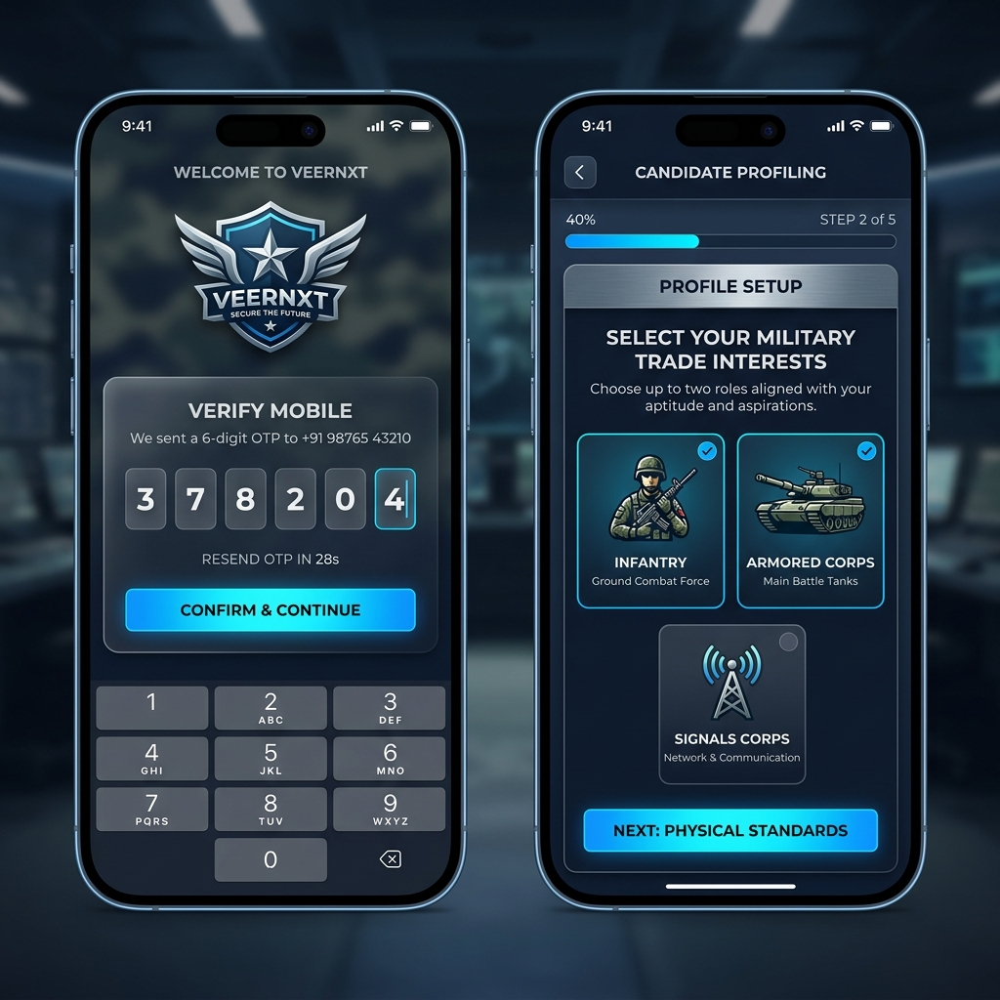
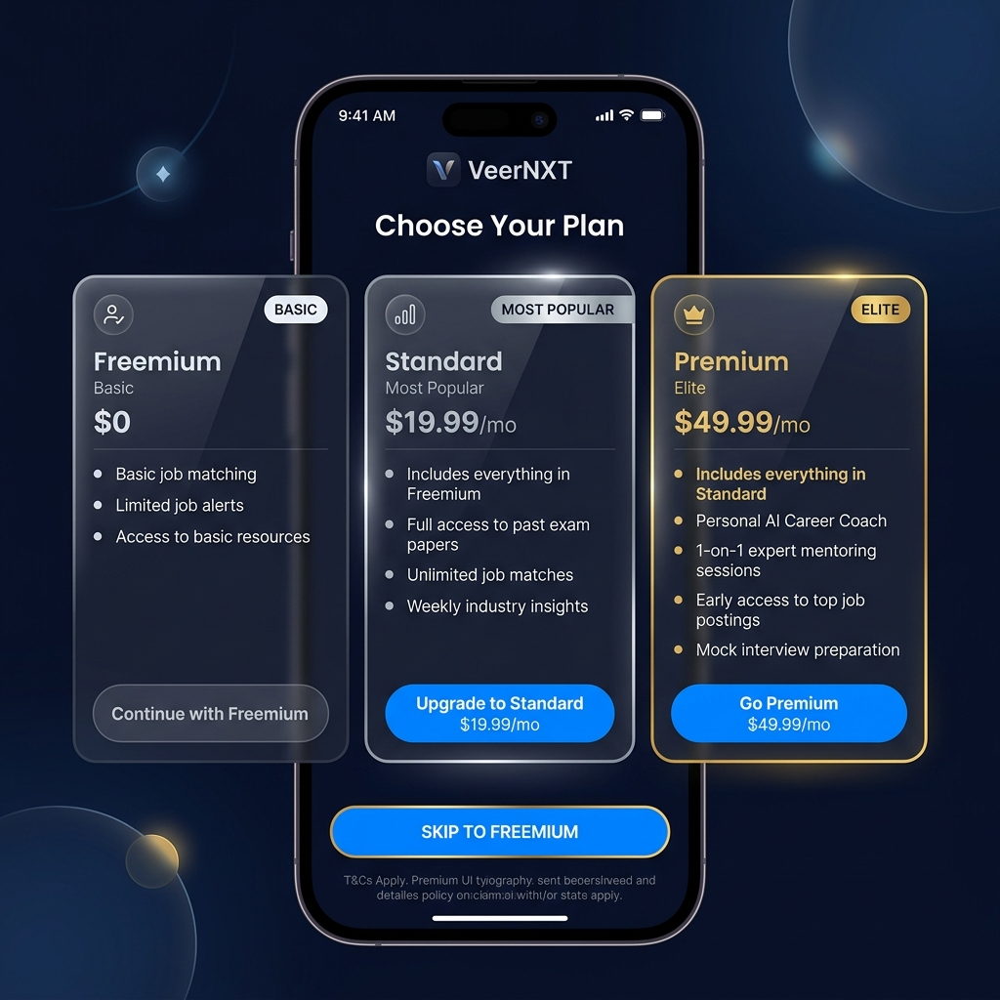
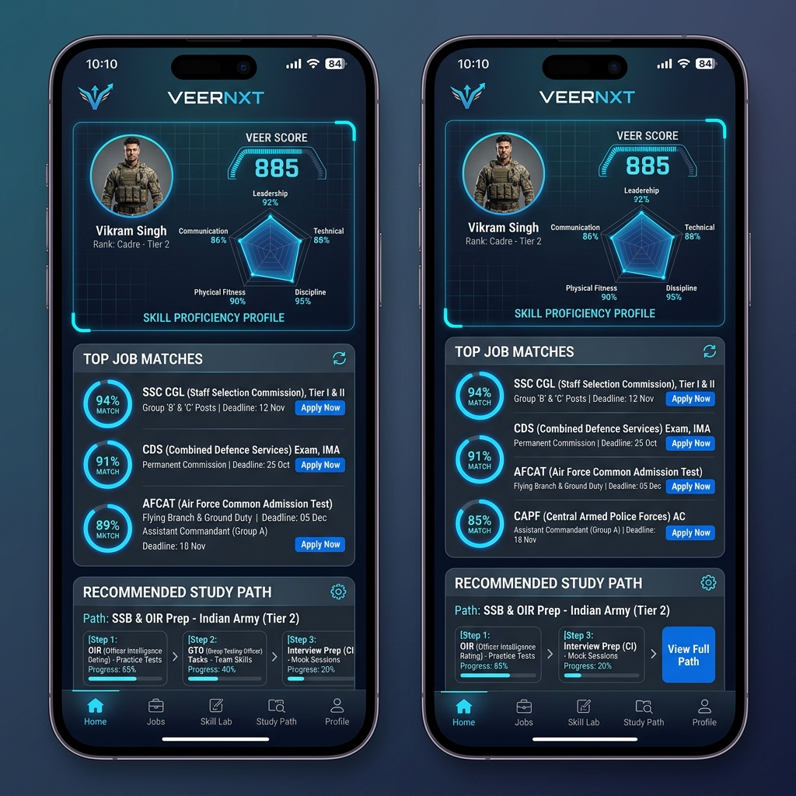
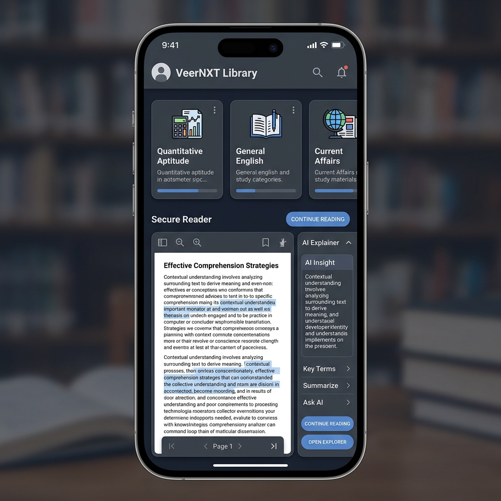

# VeerNXT Profiling Engine: UI/UX Design Specification

This document details the high-fidelity UI flow for the VeerNXT Profiling Engine. The flow is designed to maximize engagement for military candidates (Agniveers) transitioning to civilian careers, providing a clear path from onboarding to resource-backed recommendations.

## 1. User Journey Overview

The flow follows a 7-step sequence:
1.  **Secure Login**: OTP-based authentication.
2.  **Profiling Engine (Questionnaire)**: capturing service history and skills.
3.  **Tier Selection**: Monetization gate with a "Skip to Freemium" option.
4.  **The Veer Profile**: A comprehensive visualization of the candidate's digital identity.
5.  **Job Recommendations**: AI-driven career matches with detailed scoring breakdowns.
6.  **Resource Library**: A curated repository of study materials.
7.  **Secure Content Reader**: A premium reading experience for textbooks and guides.

---

## 2. Visual Design Walkthrough

### 2.1 Onboarding & Profiling Engine
The initial experience focuses on security and ease of data entry. Using a "Digital Military" aesthetic—navy blue and brushed steel—the app builds trust from the first interaction.

### 2.2 Subscription Tiers
Presenting value clearly through tiered cards. Candidates can see exactly what they get in Standard and Premium (Past papers, AI coach) while remaining able to proceed for free.

### 2.3 Dashboard & Job Matches
The heart of the system. Candidates see their 'Veer Score' and a radar chart of their military-transferred skills. Job recommendations are ranked by match percentage.

### 2.4 Library & Secure Reader
A focus on educational success. The library organizes materials by subject, and the reader provides a high-quality, secure view of study guides.

---

## 3. Key Design Principles

*   **Authority & Trust**: Military-inspired color palette and iconography.
*   **Progressive Disclosure**: Information is revealed as the user moves through the flow (e.g., matching breakdown only after clicking a job).
*   **Gamification**: Scores and radar charts encourage profile completion and skill improvement.
*   **Conversion Optimization**: Strategic placement of the Tier selection screen before the full results are revealed.

## 4. Technical Implementation Notes

*   **Theme**: Support for Dark/Light modes with a preference for High-Contrast Dark.
*   **Charts**: Use modern charting libraries (e.g., Radar/Spider charts for skills).
*   **Security**: Implement signed URLs for library content as per the `ROADMAP.md` secure reader strategy.

---
*Created for VeerNXT Profiling Engine Project*
